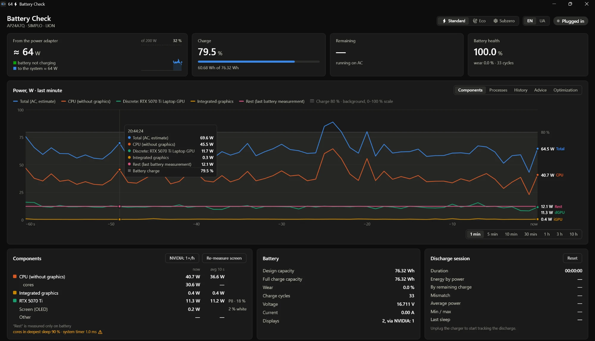

# Battery Check

**English** · [Українська](README.uk.md)

A Windows laptop battery and power monitor: see where the watts go — by component and by app — and cut idle drain. Windows 10/11, no administrator rights, nothing to install besides the app itself.



## What it does

- **Live power draw** — total from the battery, split into CPU, integrated graphics, NVIDIA GPU and the rest (screen, board, SSD, Wi-Fi), with a chart from 1 minute to 10 hours. The tray icon shows the current watts.
- **Apps** — estimated power per process; which apps keep the NVIDIA GPU awake; what runs while you are away.
- **Battery** — health and wear, charge cycles, time remaining, and whether the Windows charge percentage is honest (energy delivered vs. the percentage drop).
- **History** — every discharge: time on battery, energy used, average power, projected full runtime, and where the energy went (screen, idle, top apps).
- **Idle baseline** — what this laptop draws when nothing happens, and how many watts above it you are right now.
- **NVIDIA wake log** — when the discrete GPU woke up, for how long, what it cost and the likely cause.
- **Advice** — concrete steps based on your own measurements; a **before / after** check measures whether a change actually helped.
- **On battery profile** — lower brightness and refresh rate, efficiency mode for chosen apps; everything is restored when you plug in.
- **Power modes** — ⚡ Standard (nothing changed), 🍃 Eco (no CPU boost, energy saver, background apps in efficiency mode, apps moved off the discrete GPU), ❄ Subzero (Eco plus a CPU cap and stopping vendor background services, with your consent via UAC).

Interface in English and Ukrainian. Every feature in detail — how it measures, the limits, log formats — is in the **[full guide](docs/GUIDE.md)**.

**Desktop PCs** (no battery) work too: CPU, integrated graphics, NVIDIA GPU, per-app power, the system timer, advice and the Eco/Subzero modes. Battery tiles, history and the screen measurement are hidden, and the whole PC's draw is not shown — a desktop has no sensor for it. To try this mode on a laptop: `BatteryCheckGui.exe --no-battery`.

## Install

1. Download `BatteryCheckSetup-<version>.exe` from [Releases](https://github.com/nik-agilefox/BatteryCheck/releases/latest).
2. Run it. The exe is not code-signed, so Windows SmartScreen will warn: **More info → Run anyway**.

The app is installed for the current user only, into `%LOCALAPPDATA%\Programs\BatteryCheck` (logs in its `logs` folder), with a Start menu shortcut and an entry in **Installed apps** to uninstall. Silent mode: `BatteryCheckSetup.exe /silent`.

**Updates.** The **Check updates** button at the bottom of the window (the app also checks on start and every 6 hours). When a newer release is out it turns into **Update to X**: the app downloads it, verifies size and SHA-256, swaps its files and restarts. Logs and settings are kept.

**Uninstall** from Installed apps. If Eco or Subzero is on, switch to Standard first — that restores the Windows power settings the mode changed.

## Privacy

Everything stays on your computer: measurements are written to CSV files in the `logs` folder and are never sent anywhere. The only network request is the update check to the GitHub API.

## Build from source

Uses the C# compiler that ships with .NET Framework 4.8 — part of every Windows 10/11, nothing else to install.

```
build.cmd                   build into bin\
test.cmd                    run the tests
bin\BatteryCheckGui.exe     window app
bin\BatteryCheck.exe        console version
bin\BatteryCheckSetup.exe   installer (both exe inside)
```

Source layout: `src\Core` — measurements, logs and logic shared by both versions; `src\Gui` — the window (WPF, no XAML); `src\Console`; `src\Setup` — the installer; `tests`; `tools` — helper scripts. Advice rules and vendor lists are in `src\Core\rules.json`; your own additions go into `rules.user.json` in the app folder, next to `logs`.

Release a version: `powershell -ExecutionPolicy Bypass -File tools\release.ps1 -Version 1.0.1 -Notes "What changed"` — sets the version, runs the tests, builds, and publishes a GitHub release with the update package and the installer.
